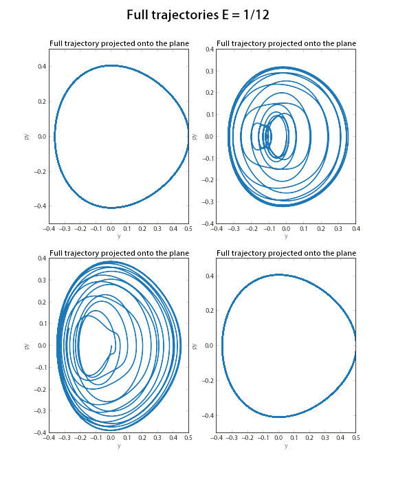
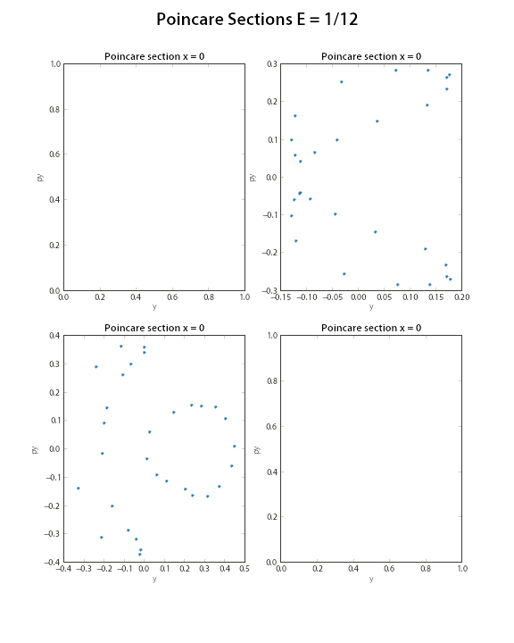

The main function, rk_demo.py, plots the solutions of the Henon-Heiles orbital problem for two different initial energies. It calls a library of functions, rk4_poincare.py, that includes a basic runge kutta integration scheme and a means of detecting zero crossings in the numerical solution, from which a Poincare map can be generated for the x=0 plane.

